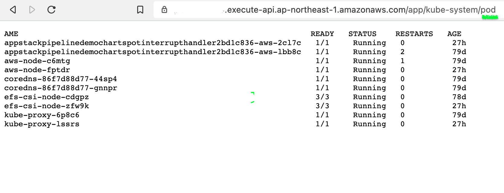

# Get EKS resource via apigateway and lambda
```bash
#export ENVVARS 
export CLUSTER_ADMIN_ROLE_ARN="arn:aws:iam::123456789012:role/eksadminMastersRole"
export CLUSTER_NAME="mycluster_name"

#To synth 
cdk synth -c CLUSTER_ADMIN_ROLE_ARN=$CLUSTER_ADMIN_ROLE_ARN  -c CLUSTER_NAME=$CLUSTER_NAME

#To Diff
cdk diff -c -c CLUSTER_ADMIN_ROLE_ARN=$CLUSTER_ADMIN_ROLE_ARN  -c CLUSTER_NAME=$CLUSTER_NAME

#To Deploy
cdk deploy --require-approval never -c CLUSTER_ADMIN_ROLE_ARN=$CLUSTER_ADMIN_ROLE_ARN  -c CLUSTER_NAME=$CLUSTER_NAME

#To Destroy
cdk destroy -f

 ✅  imagecode

Outputs:
imagecode.URL = https://xxxxxxx.execute-api.ap-northeast-1.amazonaws.com/

invoke url https://xxxxxxx.execute-api.ap-northeast-1.amazonaws.com/app/
```


### Example 
#### default get all namespace pod .
#### get service -n kube-system


#### get pod -n kube-system
